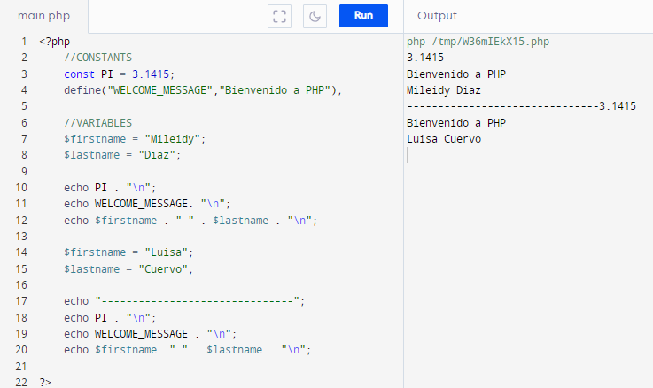
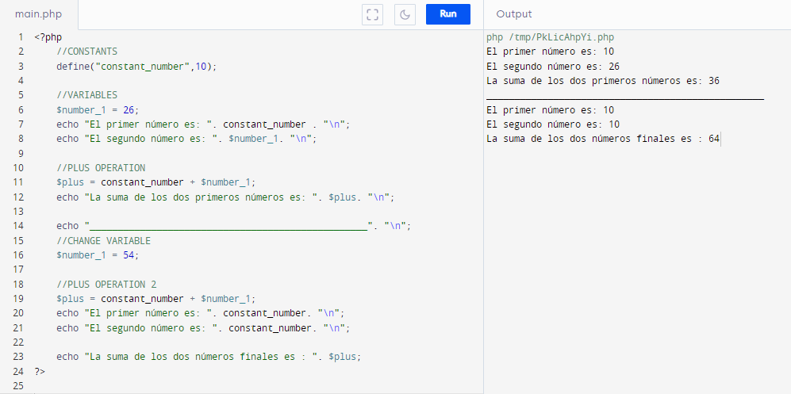
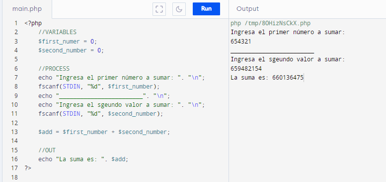
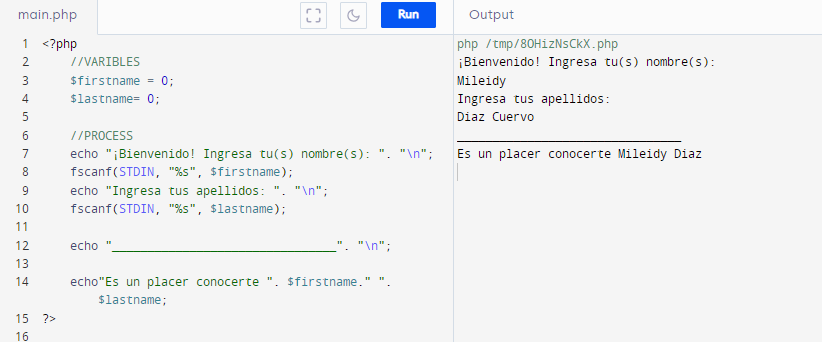
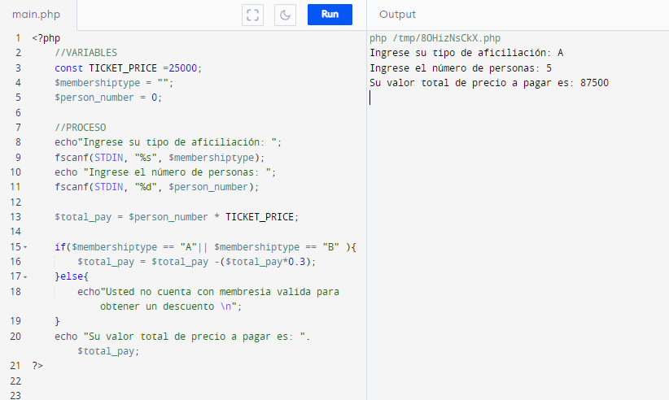
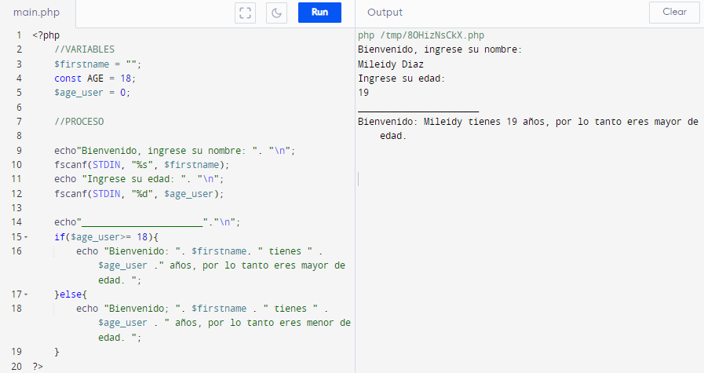
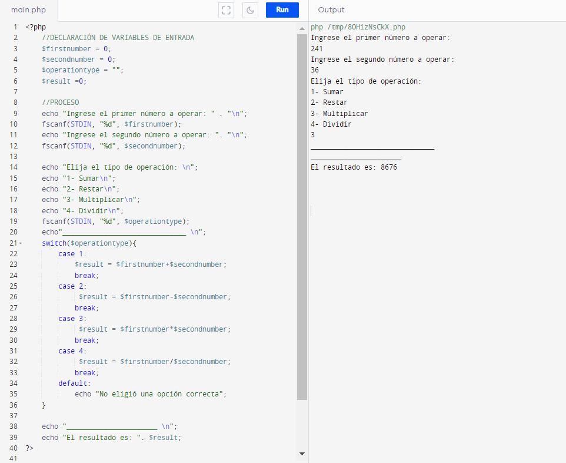
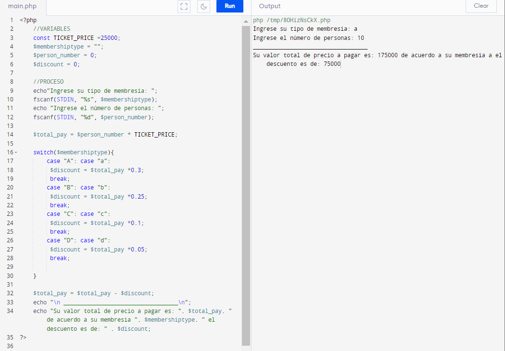

<h1>Taller 1 Mileidy Natali Diaz Cuervo </h1>

<h2> Información</h2>

Curso: full Stack Básico - Grupo 1 

Profesor: Cristian Patiño

<h2> Punto 1: Constantes y Variables</h2>

Mostrar en consola algunas constantes y variables cambiando el valor de las variables

<h2> Punto 2: Suma de constante y variable</h2>

Generar la suma de dos números dentro de una constante y una variable y luego cambiar el valor de la variables para sumarlas de nuevo.

<h2> Punto 3: Suma de 2 números ingresados por el usuario</h2>

Generar la suma de dos números ingresados por el usuario. 

<h2> Punto 4: Nombre y apellido del usuario</h2>

Mostrar en consola el nombre y apellido ingresado por el usuario. 

<h2> Punto 5: Calculo de pago en Bolera con IF</h2>

Dado el tipo de afiliación y el número de personas digitados por el usuario generar el valor de las entradas a la bolera teniendo en cuenta que si el tipo de afiliación  es ‘A’ o ‘B’ tendrá un descuento del  30% del total y el valor es de $25.000 por persona.

<h2> Punto 6: Usuario mayor o menor de edad</h2>

Dado el nombre y la edad del usuario, generar un mensaje que incluya el nombre del usuario e indique si es mayor de edad o no. 

<h2> Punto 7: Operaciones básicas entre 2 números</h2>

Generar la operación de dos números digitados por el usuario pudiendo el usuario sumar, restar, multiplicar o dividir. 

<h2> Punto 8: Calculo de pago en Bolera con SWITCH</h2>

 Dado el tipo de afiliación y el número de personas digitados el usuario generar el valor de las entradas a la bolera teniendo en cuenta que si el tipo de afiliación  es ‘A’  tendrá un descuento del  30% del total si es tipo ‘B’ el 25%, si es tipo ‘C’ del 10% y si es tipo ‘D’ del 5%, el valor es de $25.000 por persona.

<h2> Punto 9: Tabla del 0 al 30 WHILE</h2>

Dado un número digitado por el usuario generar la tabla de multiplicar de del 0 hasta el 30;(While)
 

<h2> Punto 10: Números pares del 0 al 100 WHILE</h2>

 Generar un programa que muestre los números pares del 1 al 100 (while)

<h2> Punto 11: Números pares del 0 al 100 For</h2>

 Generar un programa que muestre los números pares del 0 al 100 y haga una suma de ellos (for)

<h2> Punto 12: Tabla del 0 al 30 FOR</h2>

Dado un número digitado por el usuario generar la tabla de multiplicar de del 0 hasta el 30 (for) 

<h2> Punto 13: Suma de un arreglo</h2>

Dado un arreglo numérico de 5 posiciones generar la suma de los numeros (for) 

<h2> Punto 14: Revisión de contraseña</h2>

Dada una contraseña a registrar por el usuario generar validaciones de si esta contraseña es segura o no teniendo en cuenta que una contraseña es segura si:

Tiene 8 o más Caracteres
Tiene al menos una letra mayúscula
Tiene al menos un número

<h2> Punto 15: Operaciones básicas entre 2 números con funciones</h2>

Generar la operación de dos números digitados por el usuario pudiendo el usuario sumar, restar, multiplicar o dividir
USANDO FUNCIONES
 
